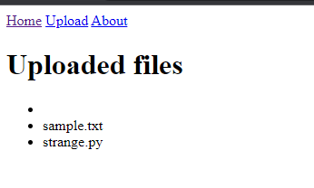
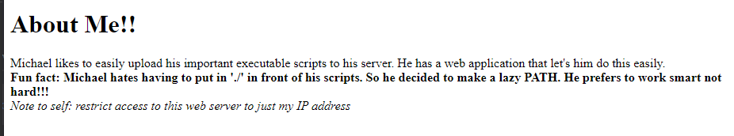
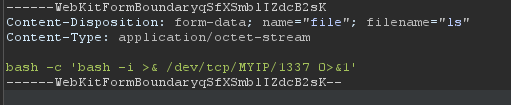
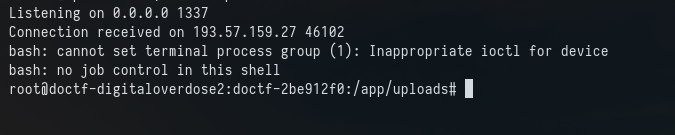
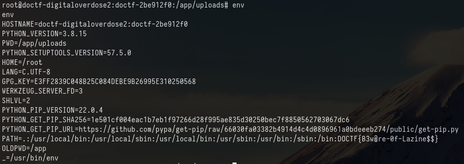

# Lazy Path

## Challenge 
Michael likes to easily upload his important executable scripts to his server. He has a web application that let's him do this easily.

Fun fact: Michael hates having to put in './' in front of his scripts. So he decided to make a lazy PATH. He prefers to work smart not hard!!!

## Solution

From going to the URL provided we can see a simple page with 3 buttons. "Home", "Upload" and "About"

The About page gives us a little bit more info...

From reading this we understand the Michael has put "." into his path so he can be "lazy" and run run local files with "program" and not "./program"

The idea for exploit here is to upload a file with the name of a program we expect to be run by Michael / or the web page, due to "." being in the path it will first look in the folder the command is run from. So if "whoami" is run and we upload a file with called "whoami" with some malicious payload, our payload will run.

my first few ideas were "python" and "cat". python because "strange.py" is in that folder and cat because why not.

This failed so I tried "ls" as its the first command anyone runs when you go into a folder even when you know what is in that folder but you cant trust yourself.

My file upload looks like this:

On my remote server I used nc to catch the shell "nc -lnvp 1337"

I get the file uploaded successfully message!

Got a shell!

After a bit if digging and no flag. I remembered the whole reason this was possbile was due to the PATH env. So reading the servers env we get the flag.

Flag: DOCTF{B3w@re-0f-Lazine$$}

